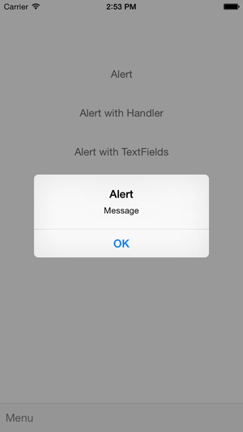
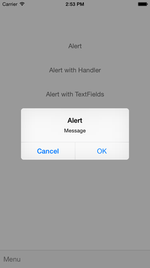
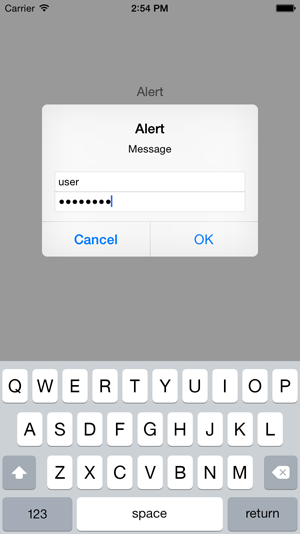
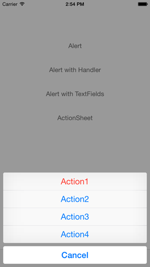
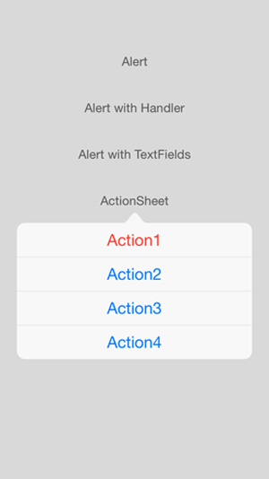
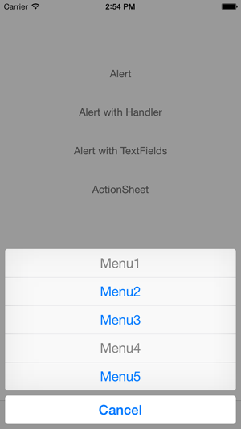
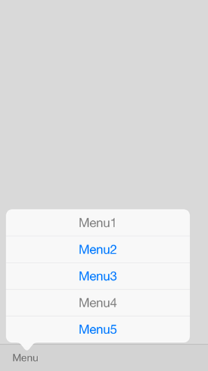

# AlertHelperKit

UIAlertController helper library in Swift

## Requirements
- Swift 1.2 (Xcode 6.3 or later)
- iOS 8.0 or later

## Installation

### Carthage

* Cartfile

```Cartfile
github "keygx/AlertHelperKit"
```

* install

```
$ carthage update
```
To integrate "AlertHelperKit.framework" into your Xcode project

### CocoaPods

* PodFile

```PodFile
source 'https://github.com/CocoaPods/Specs.git'
platform :ios, '8.0'
use_frameworks!

pod 'AlertHelperKit', :git => 'https://github.com/keygx/AlertHelperKit'
```
* install

```
$ pod install
```

## Usage

```
import AlertHelperKit
```

### Alert

```ViewController.swift
AlertHelperKit().showAlert(self, title: "Alert", message: "Message", button: "OK")
```



### Alert with callback handler

```ViewController.swift
alert.title = "Alert"
alert.message = "Message"
alert.cancelButton = "Cancel"
alert.otherButtons = ["OK"]

alert.showAlertWithHandler(self, style: .Alert) { buttonIndex in
    switch buttonIndex {
    	//
    }
}
```



### Alert with TextFields

```ViewController.swift
var alert = AlertHelperKit()
alert.title = "Alert"
alert.message = "Message"
alert.cancelButton = "Cancel"
alert.otherButtons = ["OK"]
alert.inputFields = [InputField(placeholder: "username", secure: false), InputField(placeholder: "password", secure: true)]

alert.showAlertWithHandler(self, style: .Alert) { buttonIndex in
    switch buttonIndex {
    case 0:
        println("Cancel: \(buttonIndex)")
    default:
        println("OK: \(buttonIndex)")
        
        if let textFields = alert.textFields {
            // username
            let name: UITextField = textFields[0] as! UITextField
            if count(name.text) > 0 {
                println(name.text)
            }
            // password
            let pass: UITextField = textFields[1] as! UITextField
            if count(pass.text) > 0 {
                println(pass.text)
            }
        }
    }
}
```



### ActionSheet

```ViewController.swift
var sheet = AlertHelperKit()
sheet.cancelButton = "Cancel"
sheet.destructiveButtons = ["Action1"]
sheet.otherButtons = ["Action2", "Action3", "Action4"]
sheet.sender = sender
sheet.arrowDirection = .Up

sheet.showActionSheet(self, style: .ActionSheet) { buttonIndex in
    switch buttonIndex {
    	//
    }
}
```




### ActionSheet

```ViewController.swift
var sheet = AlertHelperKit()
sheet.cancelButton = "Cancel"
sheet.otherButtons = ["Action1", "Action2", "Action3", "Action4", "Action5"]
sheet.disabledButtons = ["Action1", "Action4"]
sheet.sender = sender
sheet.arrowDirection = .Down
sheet.popoverStyle = .BarButton

sheet.showActionSheet(self, style: .ActionSheet) { buttonIndex in
    switch buttonIndex {
    	//
    }
}
```



## License

AlertHelperKit is released under the MIT license. See LICENSE for details.

## Author

Yukihiko Kagiyama (keygx) <https://twitter.com/keygx>

